---
hide:
    - navigation
icon: material/format-text
title: Instalación de LaTeX con TexStudio
---

## Índice

!!! question "Nota"
    Puedes navegar cómodamente por el tutorial usando los enlaces a la derecha en ordenador, en el botón de arriba a la izquierda si estás en móvil.

* [Pretexto](#pretexto)
* [Requisitos](#requisitos)
* [Instalación con MikTex y TexStudio](#instalación-con-miktex-y-texstudio)
    * [MikTex](#miktex)
    * [TexStudio](#texstudio)
    * [TexWorks](#texworks)

---

### Requisitos

#### Obligatorio

* [MikTex](https://miktex.org/download)

+ [TexStudio](https://www.texstudio.org/)

---

## Instalación con MikTex y TexStudio

### MikTex

Para **instalar** MikTex, **dirígete** a su página web: <https://miktex.org/download>. Es más, MikTex **ofrece** un **tutorial de instalación** el cual se hará referencia en esta página, aunque puedes **consultarlo** en cualquier momento aquí: <https://miktex.org/howto/install-miktex>.

Si quieres descargar MikTex directamente, puedes usar este enlace:

[Descargar MikTex](https://miktex.org/download/ctan/systems/win32/miktex/setup/windows-x64/basic-miktex-23.10-x64.exe){.md-button}

Para instalar MikTex paso a paso:

1. Deja seleccionado `Install MikTex only for me` y presiona `Next`.
2. Mantén el directorio de instalación por defecto y presiona `Next`.
3. **Recomiendo** dejar la opción en vez de `Ask me first` por `Always` en `Install missing packages on-the-fly`, para que se **instalen** los paquetes **automáticamente** si al compilar un documento falta ese paquete.
4. En `Review`, **comprueba** que las **opciones** son las **mismas** que en la cuarta imagen de abajo y presiona `Start` para comenzar la instalación.

=== "Proceso en imágenes"
    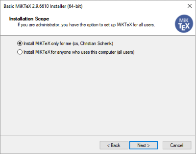{data-gallery="miktex"}
    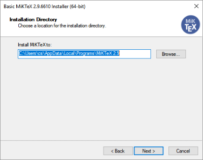{data-gallery="miktex"}
    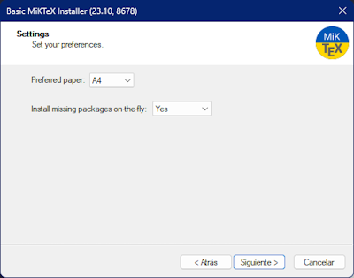{data-gallery="miktex"}
    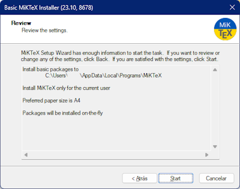{data-gallery="miktex"}

Una vez finalizada la instalación, tendrás un nuevo programa llamado *MikTex Console*, el cual es un gestor de paquetes de MikTex.

Desde aquí puedes instalar, actualizar y desinstalar paquetes de MikTex de forma sencilla, además de actualizarlos.

También **recomiendo, al menos,** abrir una vez *MikTex Console* para que se actualicen los repositorios de paquetes de MikTex.

??? tip "Instalar todos los paquetes disponibles en MikTex (avanzado)"

    Si prefieres instalar **TODOS** los paquetes disponibles con MikTex tienes que hacer lo siguiente:

    1. Ve a la pestaña `Packages`.
    2. Ordena los paquetes por `Installed on` para que los paquetes que no tengas instalados aparezcan arriba.
    3. Cuando tengas ordenados los paquetes, selecciona el primero, y haz scroll hasta que veas el primer paquete con una fecha. MANTEN `Shift` y haz click en ese paquete.
    4. **IMPORTANTE**: BUSCA EL PAQUETE `autosp`, este paquete no esste en ningún repositorio y NO podrás instalar todo de forma automática. Deselecciona el paquete con `Ctrl+Click`.
    5. Una vez deseleccionado, presiona el botón de un `+` para instalar todos los paquetes.
    6. Mientras se instalan los paquetes, aparece una ventana "Package Installation" con descripnión: "The required file <paquete>" desmarca la casilla "Always show this dialog before installing packages" y presiona "Install"; para automatizar la instalación al completo. 
    7. Cuando el botón "Cancel" cambie a "Close", significa que todo el proceso ha finalizado. Cierra MikTex Console para proceder a instalar Perl.

### TeXStudio

Si has leído esta guía anteriormente, es posible que recuerdes que recomendé instalar VSCode. Después de probar TexStudio, he decidido cambiar la recomendación a TexStudio, ya que es más sencillo de usar y no requiere tantos pasos como Latex-Workshop.

Para **instalar** TexStudio, **dirigete** a su página web: <https://www.texstudio.org/>. El enlace de descarga directa es este:

[Descargar TexStudio](<https://github.com/texstudio-org/texstudio/releases/download/4.6.3/texstudio-4.6.3-win-qt6.exe>){.md-button}

Para instalar TexStudio solo necesitas confirmar la ruta de instalación y presionar `Instalar`.

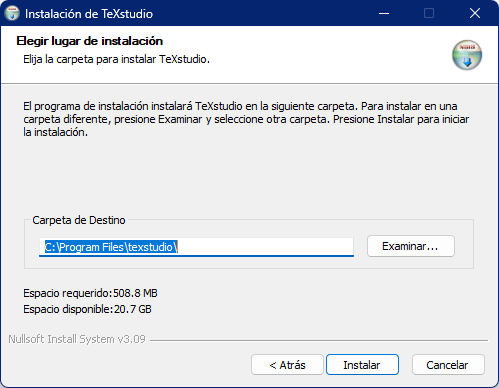{data-gallery="texstudio"}

#### Uso de TexStudio

TexStudio puede ser un poco amenazador al principio debido a la gran cantidad de opciones que dispone. Si en cualquier momento necesitas **ayuda** o no sabes cómo hacer algo, puedes utilizar la ayuda de TexStudio, la cual **se encuentra en** `Ayuda -> Ayuda de TexStudio` o pulsando `F1`. (1) Recomiendo echar un vistazo por los menús, ya que hay demasiadas funciones como para explicarlas en profuncidad.
{.annotate}

1. Este manual se encuentra de forma local con la instalación de TexStudio, por lo que no necesitas conexión a internet para usarlo. (1)
{.annotate}

    1. Si no funciona, puedes descargar la ayuda desde la página web de TexStudio: <https://texstudio-org.github.io/getting_started.html>

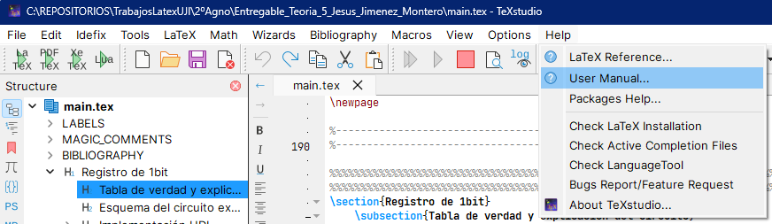

Sin embargo, explicaré funciones básicas:

##### Barra de herramientas

El sistema de interfaz de TexStudio es similar a LibreOffice y OpenOffice. En la barra principal tienes las opciones más comunes:
{data-gallery="texstudio"}

* `Build and view`: Compila el documento con el compilador por defecto (1) y abre el documento compilado en un visor lateral.
{.annotate}
* `Compile`: Compila el documento con el compilador por defecto, sin abrir el documento.
{.annotate}
* `Stop Compilation`: Si hay una compilación activa, la detiene mediante un error y no procesará nada.
* `View`: Abre el documento compilado en un visor lateral (2).
* `View log`: Abre un panel inferior con los problemas que hubiesen habido después de la compilación.
* `part`: Comandos para secciones, subsecciones, etc.
* `label`: Comandos de referencias, etiquetas y referencias de bibliografía. (3)
* Herramientas de tablas: Comandos similares a otros editores de texto, añadir columna, fila, etc.

1. El cual es pdflatex, el mismo que viene por defecto en Overleaf.
2. Si existe
3. \cite{bibliografia}, \ref{etiqueta}, \label{etiqueta}

##### Compilar un documento

Los comandos de compilación de tanto el documento, como de bibliografía, índices, etc. se encuentran en la barra superior de TexStudio.

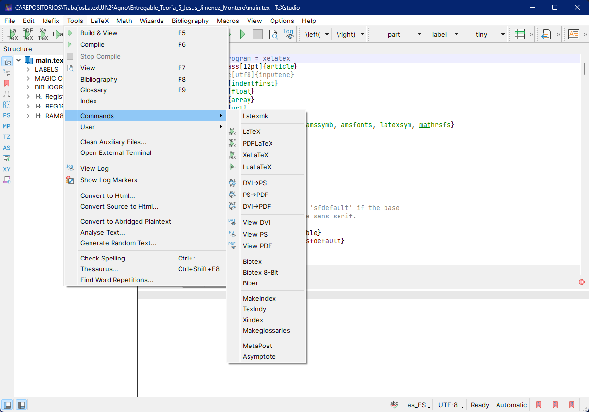{data-gallery="texstudio"}

##### Sugerencias de código

En cualquier momento o al escribir `\`, TexStudio sugerirá comandos de LaTeX. Puedes navegar por las sugerencias con las flechas del teclado y seleccionar la sugerencia con `Enter`.
También puedes invocar de nuevo las sugerencias con `Ctrl+Space`.

##### Commandos automáticos (Wizards)

TexStudio dispone de comandos automáticos para tareas sencillas como crear imágenes o tablas.

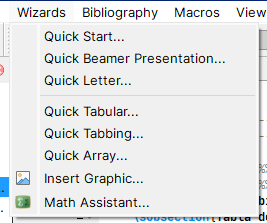{data-gallery="texstudio"}

??? info "Algunos ejemplos"

    ###### *Insert Graphic*
    Para crear una imagen, haz click en el botón de la imagen y aparecerá una ventana emergente. En esta ventana puedes seleccionar la ruta de la imagen, el tamaño, la posición, etc.

    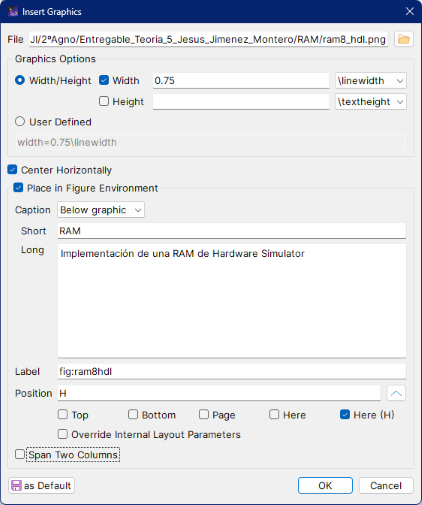{data-gallery="texstudio"}

    ###### *Quick Tabular*
    Para crear una tabla, haz click en el botón de la tabla y aparecerá una ventana emergente. En esta ventana puedes seleccionar el número de columnas y filas, el tamaño, la posición, etc.

    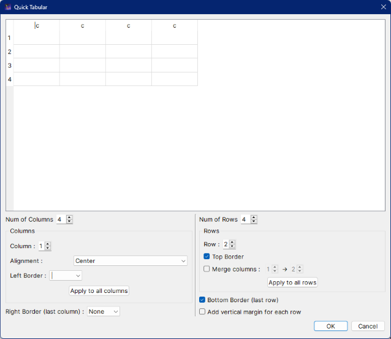{data-gallery="texstudio"}

---

### TexWorks

Si prefieres algo más sencillo, puedes usar Texworks, el cual es un editor de LaTeX con un visor de PDF integrado. Viene incluido tanto MikTex como TexLive, así que no necesitas instalar nada más.

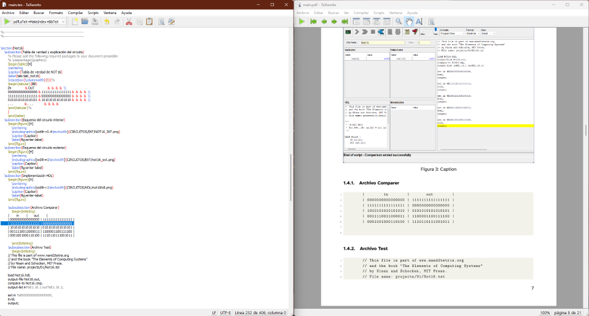

TexWorks es un editor de LaTeX mucho más sencillo que VSCode, pero soporta la mayoría de las funciones de LaTex-Workshop. No explicaré en profundidad, tiene una interfaz muy sencilla y cualquier problema se puede solucionar con el manual incluido el cual puedes encontrar en:
<http://people.whitman.edu/~balofba/m497s16/TeXWorks.pdf>
