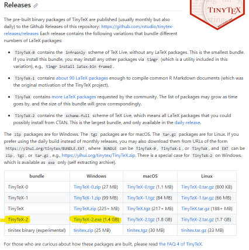

# Instalación local de LaTeX en Windows como alternativa a Overleaf

??? info "Versión actual: 1.0.3 (17/10/2023)"

    * Añadidos iconos para editar la página.
    * Añadidos enlaces a la página de GitHub.
    * Añadido una fecha de edición al final de la página.
    * Aclarar panel de novedades.
    ---
    ??? info "Versiones anteriores"
        Lista de cambios (1.0.2):

        * Añadido un aviso de que la página está en construcción.
        * Añadir versión actual. 
        * Añadir reglas horizontales para separar secciones.

## &darr; POR FAVOR LEE ESTE AVISO &darr;

!!! warning "PÁGINA EN COSTRUCCION"
    Planeo añadir nuevas herramientas y cambios a esta página, asi que se considera como no finalizada.
    ## Los siguientes cambios serán:

    * Añadir a la lista de opciones [TexStudio](https://www.texstudio.org/).
    * Simplificar todavía el proceso de instalación.
        * *Probablemente se cambie el tutorial para priorizar la instalación de TexStudio por ser más fácil de usar.*
    * Añadir una sección para usar GitHub con LaTeX, y por extensión, GitHub Desktop.
    * Resaltar en negrita las palabras principales siguiendo el criterio de lectura.

## Índice

!!! question "Nota"
    Puedes navegar cómodamente por el tutorial usando los botones de la barra de navegación de la izquierda.

* [Pretexto](#pretexto)
* [Requisitos](#requisitos)
    * [Obligatorio](#obligatorio)
    * [Opcional](#opcional)
* [Instalación con MikTex](#instalación-con-miktex)
    * [VSCode](#vscode)
    * [Instalación de MikTex](#instalación-de-miktex)
    * [Instalación de Perl](#instalación-de-perl)
    * [Post-instalación de MikTex y Strawberry Perl](#post-instalación-de-miktex-y-strawberry-perl)
* [Instalación con TinyTex](#instalación-con-tinytex)
    * [VSCode](#vscode-1)
    * [TinyTex](#tinytex)
    * [Post-instalación de TinyTex](#post-instalación-de-tinytex)
* [Latex-Workshop](#latex-workshop)
    * [Synctex](#synctex)
    * [Cambiar compilador](#cambiar-compilador)
    * [Los captions o índices no se actualizan](#los-captions-o-índices-no-se-actualizan)
    * [Configuración de Latex-Workshop](#configuración-de-latex-workshop)
* [Texworks](#texworks)


## Pretexto

He creado este tutorial debido a los recientes cambios en [Overleaf](https://www.overleaf.com/blog/changes-to-free-compile-timeouts-and-servers) de los cambios en tiempo de compilación. 
Según Overleaf, no debería afectar a los usuarios debido a tiempos de compilación más rápidos; sin embargo, el tutorial asume que desconfías de Overleaf.

Así que, este tutorial te enseñará a instalar un compilador de LaTeX en tu ordenador, con dos opciones dependiendo de lo que prefieras. Medianteel uso de [VSCode](https://code.visualstudio.com/) y [MikTex](https://miktex.org/download) o Tex Live, distribuido con [TinyTex](https://github.com/rstudio/tinytex-releases).
También se da la opción de usar [TexWorks](#texworks), el cual viene incluido en MikTex y TexLive y es más sencillo de usar que VSCode.

Si ves ualquier error en la página o quieres dejar alguna sugerencia, puedes escribir un issue en el repositorio de Github: <https://github.com/JesusJMUJI/jesusjm-website> o mandarme un mensaje privado por Discord. 

??? warning "Aviso"
    Este tutorial asume que el lector dispone de conocimientos básicos sobre instalación y entendimiento sobre como usar VSCode e instaladores complejos. No obstante, se intentará explicar de la forma más sencilla posible. Además, se requiere de entender el inglés, ya que la mayoría de los programas están en inglés.

---

### Requisitos
#### Obligatorio
* [VSCode](https://code.visualstudio.com/)

* [MikTex](https://miktex.org/download)
* [Strawberry Perl](https://strawberryperl.com/)

??? quote "Por qué MikTex con Strawberry Perl"
    Recomiendo encarecidamente usar MikTex con Strawberry Perl, ya que, aunque requiera más pasos; el nstalador de TinyTex está roto en mi ordenador y no he podido arreglarlo. Para no dar información errónea, he decidido explicar como instalar MikTex con Strawberry Perl, ya que es el método que he usado para instalar LaTeX en mi ordenador. 
    Auqnue si prefiere TexLive o funciona en tu ordenador, sigue el tutorial de [TinyTex](#instalación-con-tinytex)

* [LaTeX Workshop](https://marketplace.visualstudio.com/items?itemName=James-Yu.latex-workshop)

#### Opcional
* [Github Desktop](https://desktop.github.com/)
* [TinyTex](https://github.com/rstudio/tinytex-releases)

*****

## Instalación con MikTex
#### VSCode
Descarga e instala VSCode desde aqui: <https://code.visualstudio.com/>.
Este es el paso más sencillo, y ya que no es el objetivo de este tutorial, no se explicará más.

Ya que estamos con el paso de VSCode, para instalar la extensión:

1. Abre VSCode
2. Pulsa `Ctrl+Shift+X` o ve a la pestaña de extensiones, señalada con la flecha roja "1".
3. Busca "LaTeX Workshop", señalado con la flecha roja "2".
4. Pulsa en la extensión "LaTeX Workshop", señalado con la flecha roja "3".
5. Pulsa en "Install", señalado con la flecha roja "4".
 

Una vez que tengas todo instalado en VSCode, no necesitas hacer nada más por ahora. 

### Instalación de MikTex
Para instalar MikTex, dirigete a su página web: <https://miktex.org/download>. Es más, MikTex ofrece un tutorial de instalación el cual hare referencia en esta página, aunque puedes consultarlo en cualquier momento aquí: <https://miktex.org/howto/install-miktex>.

El instalador es prácticamente idéntico a otros instaladores de Windows, así que no deberías tener problemas en instalarlo.
Paso a paso:

1. "Install MikTex only for me" y presiona "Next".
2. No toques el directorio de instalación.
3. Recomiendo setear "Install missing packages on-the-fly" por "Always", para que se instalen los paquetes automáticamente.
4. En "Review" presiona "Start" para comenzar la instalación.

Una vez finalizada la instalación, tendrás un nuevo programa llamado "MikTex Console", el cual es un gestor de paquetes de MikTex. Ábrelo.
Desde aquí puedes instalar, actualizar y desinstalar paquetes de MikTex de forma sencilla.

Para instalar TODOS los paquetes disponibles con MikTex tienes que hacer lo siguiente:

1. Ve a la pestaña "Packages".
2. Ordena los paquetes por "Installed on" para que los paquetes que no tengas instalados aparezcan arriba.
3. Cuando tengas ordenados los paquetes, selecciona el primero, y haz scroll hasta que veas el primer paquete con una fecha. MANTEN `"Shift"` y haz click en ese paquete.
4. **IMPORTANTE**: BUSCA EL PAQUETE "autosp", este paquete no esste en ningún repositorio y NO podrás instalar todo de forma automática. Deselecciona el paquete con `"Ctrl+Click"`.
5. Una vez deseleccionado, presiona el botón de un "+" para instalar todos los paquetes.
6. Mientras se instalan los paquetes, aparece una ventana "Package Installation" con descripnión: "The required file <paquete>" desmarca la casilla "Always show this dialog before installing packages" y presiona "Install"; para automatizar la instalación al completo. 
7. Cuando el botón "Cancel" cambie a "Close", significa que todo el proceso ha finalizado. Cierra MikTex Console para proceder a instalar Perl.

### Instalación de Perl

??? note "Explicación"
    La extensión de Latex Workshop requiere de Perl para poder compilar los documentos de LaTeX. Por lo que, si no instalas Perl, no podrás compilar los documentos.

Dirigete a: <https://strawberryperl.com/> y descarga la "System installer version". E instala Straberry Perl, no necesitar configurar nada del instalador, asique continua hasta instalar el programa (recuerda aceptar los requisitos de administrador).

Una vez instalado, !ya esta! Puedes usar Latex-Workshop. 

#### Post-instalación de MikTex y Strawberry Perl
Dirigete a [Latex-Workshop](#latex-workshop) para continuar con la instalación de Latex-Workshop.

----

## Instalación con TinyTex

#### VSCode
Descarga e instala VSCode desde aqui: <https://code.visualstudio.com/>.
Este es el paso más sencillo, y ya que no es el objetivo de este tutorial, no se explicará más.

Ya que estamos con el paso de VSCode, para instalar la extensión:

1. Abre VSCode
2. Pulsa `Ctrl+Shift+X` o ve a la pestaña de extensiones, señalada con la flecha roja "1".
3. Busca "LaTeX Workshop", señalado con la flecha roja "2".
4. Pulsa en la extensión "LaTeX Workshop", señalado con la flecha roja "3".
5. Pulsa en "Install", señalado con la flecha roja "4".
 

Una vez que tengas todo instalado en VSCode, no necesitas hacer nada más por ahora. 

#### TinyTex
Este es el proceso más delicado, ya que se requiere de pasos específicos para que funcione correctamente.

Ve al siguiente enlace: <https://github.com/rstudio/tinytex-releases>
Y baja abajo hasta encontrar el apartado de "Releases":


Descarga el instalador de TinyTex, señalado en amarillo.

??? note "Explicación técnica"
    Descargamos específicamente el TinyTex-2 debido a que contiene la mayória de paquetes de CTAN, es decir, equipara los paquetes instalados a los que tiene disponible Overleaf.

Una vez descargado, ejecuta el instalador de TinyTex, el cual abrirá una consola de comandos. Este proceso descomprimirá los paquetes en una nueva carpeta para ser usado como un instalador normal. Este proceso puede llevar un tiempo dependiendo de como de buenos sean tu CPU y disco.

Cuando se cierre automáticamente la consola, puedes dirigirte a la nueva carpeta llamada "TinyTex" y ejecutar install-tl-windows.bat. No necesitas configurar nada, simplemente pulsa "Instalar" y espera hasta que se instale.

##### Si el instalador no funciona
En mi ordenador, por alguna razón, no funciona el instalador de TexLive, devolviendo un error "Broken Pipe". He estado mucho tiempo intentando arreglar este error y no he podido. Así que, si no quieres tener un gestor de paquetes roto, recomiendo instalar MikTex como he comentado aqui: [Requisitos](#requisitos), "Por qué TinyTex".

Así que, lo mejor que puedes hacer es:

1. Abrir la consola de comandos con la ruta de la carpeta de TinyTex y escribir este comando *(puedes copiarlo con el botón a la derecha del bloque de código)*:

```bash title="Comandos"
install-tl-windows.bat --no-gui
```
Y debería salir algo así:


Escribe como comando: "I" y pulsa enter. Esto instalará TexLive en tu ordenador. Este proceso puede llevar un tiempo dependiendo de como de buenos sean tu CPU y disco.

#### Post-instalación de TinyTex
Dirigete a [Latex-Workshop](#latex-workshop) para continuar con la instalación de Latex-Workshop.

## Latex-Workshop
Una vez que tengas todo instalado, puedes abrir VSCode y crear un nuevo archivo de LaTeX, o puedes usar uno desde Overleaf, mientras tengas un archivo .tex, el compilador detectará automaticamente el archivo "main" y lo compilará. 

Este es la interfaz general de Latex-Workshop:


A la izquierda, cuando carge la extensión verás nuevas pestañas correspondientes al uso de Latex-Workshop. La más importante es "Latex: Commands". Desde aquí puedes compilar, ver logs, limpiar archivos temporales, ver tu archivo compilado, etc.

Vamos a probar a compilar unos apuntes de la asignatura de Consolas. 

Para realizarlo, haz click en el botón *"Build Latex Project"* con una flecha verde. **IMPORTANTE**: necsitas que el cursor para escribir este en la pestaña del documento de LaTeX, sino es el caso, los botones NO funcionaran.
Esto compilará el archivo .tex y generará un archivo .pdf.
El tiempo de compilado depende de muchos más factores que Overleaf, debido a que depende en como de potente sea tu CPU.

Cuando el archivo se compile, aparecerá un check en la barra inferior de VSCode, indicando una compilación correcta. Paar abrir el .pdf, puedes hacer click en el botón "View LaTeX PDF file". Esto abrirá el archivo .pdf en el propio visor de .pdf de VSCode.

Además, la mayoría de comandos están disponibles con el Intellisense de VSCode, por lo que puedes usarlos sin necesidad de usar los botones. Solo tienes que pulsar `Control + Espacio` y aparecerán los comandos disponibles.

##### Synctex
De hecho, puedes usar comandos muy útiles; si haces `"Control + Click"` en el documento .pdf, te llevara a la línea de código correspondiente en el archivo .tex. Para hacerlo al contrario, haz click en la línea de código en archivo .tex, y pulsa `"Control + Alt + J"`.

##### Cambiar compilador
Es posible que estes usando comandos especiales que requieran de compilador específico, como el uso de fuentes personalizadas. Para cambiarlo, donde "Build Latex Project" hay un desplegable con el nombre del compilador. Puedes cambiarlo al que desees. Normalmente, usarás "latexmk" el cual es el equivalente a "pdflatex" de Overleaf. Y "latexmk (xelatex)", el que usa si usas fuentes personalizadas.

##### Los captions o índices no se actualizan
Simplemente compila varias veces el documento hasta que aparezcan, esto es una limitación del propio Latex que Overleaf arregla de forma automática.

### Configuración de Latex-Workshop
En el menú superior de VSCode, presiona: "File -> Preferences -> Settings" y en el buscador escribe: "latex-workshop". Aparecerán todas las opciones de configuración de Latex-Workshop.

Si necesitas algún ajuste específico puedes buscarlo en la documentación de Latex-Workshop: <https://github.com/James-Yu/LaTeX-Workshop/wiki>

---

## TexWorks
Si no te gusta VSCode o prefieres algo más sencillo. , puedes usar Texworks, el cual es un editor de LaTeX con un visor de PDF integrado. Viene incluido tanto MikTex como TexLive, así que no necesitas instalar nada más.


TexWorks es un editor de LaTeX mucho más sencillo que VSCode, pero soporta la mayoría de funciones de LaTex-Workshop. No explicaré en profuncidad, tiene una interfaz muy sencilla y cualquier problema se puede soluccionar con el manual incluido el cual puedes encontrar en: 
<http://people.whitman.edu/~balofba/m497s16/TeXWorks.pdf>
